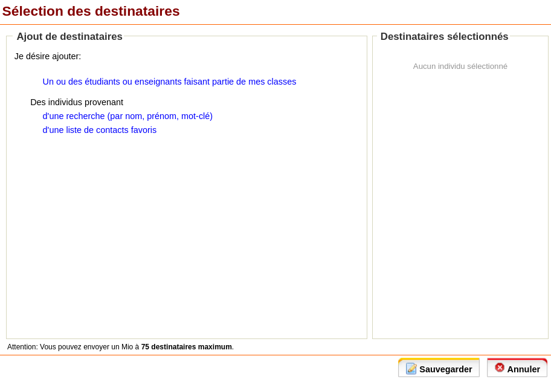
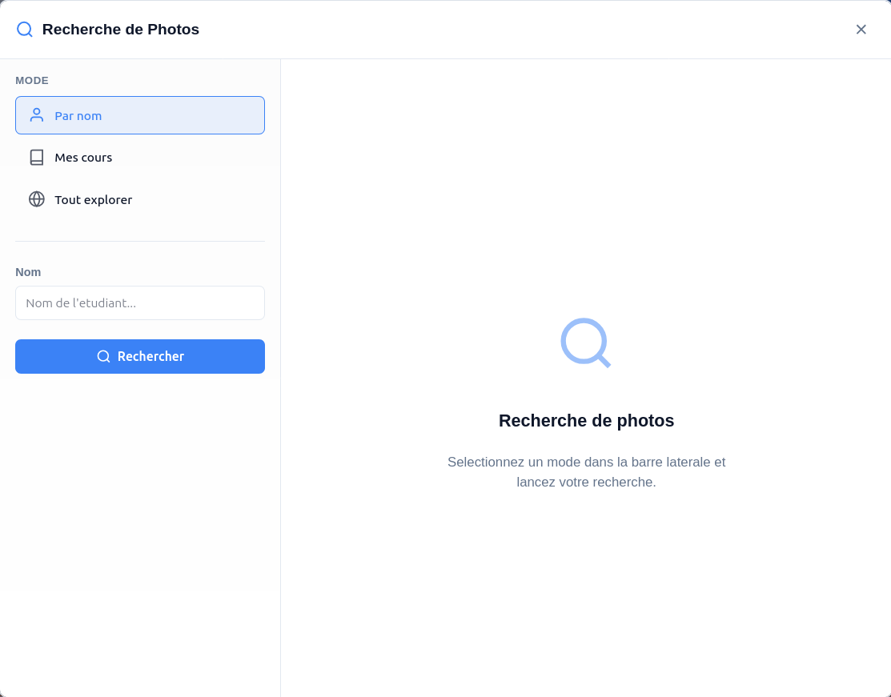

# Omnivox Photo Search

Outil de recherche de photos etudiants pour Omnivox.

## Installation

### Etape 1 : Telecharger le script

Cliquez sur `app.js` puis sur le bouton **Download** ou **Raw** pour copier le code.

### Etape 2 : Ouvrir Omnivox

Connectez-vous a votre compte Omnivox et naviguez vers la page **Messagerie MIO** (voir screenshot ci-dessous).

### Etape 3 : Ouvrir la console

- **Windows/Linux** : Appuyez sur `F12` ou `Ctrl + Shift + J` ou `Ctrl + Shift + I`
- **Mac** : Appuyez sur `Cmd + Option + J`

Une fenetre s'ouvrira en bas ou a droite de votre ecran.

### Etape 4 : Coller et executer

1. Cliquez dans l'onglet **Console**
2. Collez le code (`Ctrl + V` ou `Cmd + V`)
3. Appuyez sur **Entree**

Un bouton **"Photos"** apparaitra en haut a droite de la page.

## Modes de recherche

| Mode              | Description                              |
|-------------------|------------------------------------------|
| **Par nom**       | Rechercher un etudiant par son nom       |
| **Mes cours**     | Voir les etudiants de vos cours actuels  |
| **Tout explorer** | Parcourir tous les groupes d'une session |

## Screenshots

### Page d'utilisation
Naviguez vers cette page, puis ouvrez la console (`F12`) et collez le code :

### Interface

## FAQ

**Q: Le bouton n'apparait pas ?**
R: Assurez-vous d'etre sur une page Omnivox et que le code a ete execute sans erreur dans la console.

**Q: Les photos ne chargent pas ?**
R: Verifiez que vous etes bien connecte a Omnivox.

**Q: Comment sauvegarder mes resultats ?**
R: Utilisez les boutons d'export (CSV, JSON) ou sauvegardez la session pour la recharger plus tard.
